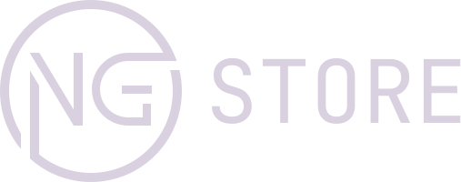

# NgStore



## درباره پروژه

این یک فروشگاه آنلاین بازی های کامپیوتری است

---

## اهداف پروژه

هدف این فروشگاه رساندن بازی ها با کمترین قیمت به گیمر های عزیز ایرانی است

---

## چگونه استفاده کنیم

### پیشنیاز های اجرای پروژه

ما در پروژه از nodejs و انگولار 12.2.1 استفاده کرده ایم لذا برای اجرای پروژه نیاز به نصب آن ها وجود دارد

### اجرای پروژه

برای این کار باید پروژه از گیت هاب دانلود کنید

ابتدا باید کد زیر را در ترمینال بزنیم

```bash
git clone https://github.com/Star-Academy/Summer1401-FE-Team05.git
```

سپس کد های زیر را بزنید تا پروژه اجرا شود

```bash
npm i

npm start
```

# مشارکت در پروژه

لطفا فایل [CONTRIBUTING.md](CONTRIBUTING.md) را مطالعه کنید
